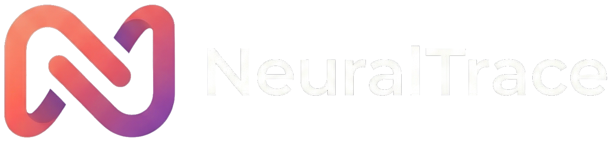

<p align="center">
  
</p>

<p align="center">
  <strong>Capture anything you browse. Every AI remembers it.</strong>
</p>

<p align="center">
  <a href="LICENSE"></a>
  <a href="https://github.com/NeuralTrace-AI/neuraltrace/stargazers"></a>
  <a href="https://github.com/NeuralTrace-AI/neuraltrace/issues"></a>
</p>

---

NeuralTrace is an open-source browser memory layer for AI agents. Save pages, notes, and context from your browser into a personal vault — then access it from any AI tool via [MCP](https://modelcontextprotocol.io) (Model Context Protocol).

**The problem:** Every AI tool starts from zero. You explain the same preferences, decisions, and context over and over — to ChatGPT, Claude, Gemini, Copilot. We call this the "Amnesia Tax."

**The fix:** Save it once in NeuralTrace, and every AI remembers it. Your vault connects to any MCP-compatible tool automatically.

## Features

- **Chrome Extension** — Side panel AI chat with memory-powered responses. Save pages, summarize content, search your vault — all without leaving the browser.
- **MCP Server** — Dual transport (SSE + Streamable HTTP) works with Claude, ChatGPT, Cursor, VS Code, and any MCP client.
- **Semantic Search** — Find memories by meaning, not just keywords. Powered by vector embeddings.
- **Quick Save** — One-click page capture. No AI round-trip, sub-second saves.
- **Background Enrichment** — Saved pages are automatically classified with tags, dates, and locations.
- **Local-First** — Your data stays on your machine. SQLite vault, no cloud required.
- **Self-Hosted** — Run the full stack on your own hardware with Docker.

## Quick Start

### Option 1: Docker (recommended)

```bash
git clone https://github.com/NeuralTrace-AI/neuraltrace.git
cd neuraltrace
cp .env.example .env
# Edit .env — add your OPENAI_API_KEY at minimum
docker compose up -d
```

Server runs at `http://localhost:3000`. Health check: `curl http://localhost:3000/health`

### Option 2: Run from source

```bash
git clone https://github.com/NeuralTrace-AI/neuraltrace.git
cd neuraltrace
npm install
cp .env.example .env
# Edit .env — add your OPENAI_API_KEY at minimum
npm run build
npm start
```

### Load the Chrome Extension

1. Open `chrome://extensions` in Chrome or Edge
2. Enable **Developer mode** (top right)
3. Click **Load unpacked** and select the `extension/` folder
4. Click the NeuralTrace icon to open the side panel

## Connect Your AI Tools

NeuralTrace speaks MCP, so any compatible tool can read and write to your vault.

### Claude Code / Cursor / VS Code

Add to your MCP config (e.g., `~/.claude/claude_desktop_config.json`):

```json
{
  "mcpServers": {
    "neuraltrace": {
      "url": "http://localhost:3000/sse"
    }
  }
}
```

### Claude.ai / ChatGPT (OAuth)

Use `http://localhost:3000/mcp` as the server URL. NeuralTrace supports OAuth 2.1 with PKCE for web-based AI platforms.

## MCP Tools

| Tool | Description |
|------|-------------|
| `add_trace` | Save a memory (content + tags) to your vault |
| `search_neuraltrace_memory` | Semantic search across your vault |
| `delete_trace` | Remove a memory by ID |
| `suggest_traces` | AI suggests what to save from the current conversation |

## Architecture

```
Browser ──► Chrome Extension (side panel chat)
                    │
                    ▼
              NeuralTrace Server (Express.js)
              ├── MCP Transport (SSE + Streamable HTTP)
              ├── REST API (auth, proxy, billing)
              ├── SQLite Vault (per-user)
              └── OpenAI Embeddings (semantic vectors)
                    │
                    ▼
        Claude / ChatGPT / Cursor / any MCP client
```

## Configuration

See [`.env.example`](.env.example) for all available options. Key settings:

| Variable | Required | Description |
|----------|----------|-------------|
| `OPENAI_API_KEY` | Yes | For generating semantic embeddings |
| `ADMIN_PASSWORD` | Yes | Protects your vault in self-hosted mode |
| `PORT` | No | Server port (default: 3000) |
| `NEURALTRACE_MODE` | No | `selfhosted` (default) or `cloud` |

## Contributing

See [CONTRIBUTING.md](CONTRIBUTING.md) for setup instructions and guidelines.

## Security

Found a vulnerability? See [SECURITY.md](SECURITY.md) for responsible disclosure.

## License

[Apache 2.0](LICENSE) — use it, modify it, ship it.
